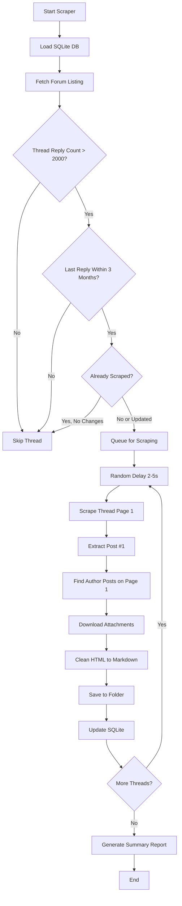

# ForexFactory Strategy Scraper - Implementation Plan

## Background

Scrape trading strategies from the ForexFactory Trading Systems forum:
- **Target URL**: https://www.forexfactory.com/forum/71-trading-systems
- **Goal**: Create LLM-ready summaries of proven trading strategies for downstream EA development

## Tech Stack

| Component | Technology |
|-----------|------------|
| Language | Go 1.25 |
| Scraper | Colly |
| Database | SQLite (incremental tracking) |
| Output | Markdown + JSON metadata |

## Filtering Criteria

| Criteria | Value | Rationale |
|----------|-------|-----------|
| Minimum replies | >2,000 | Indicates proven, battle-tested strategies |
| Recent activity | Last reply within 3 months | Ensures strategy is still actively used |
| Scope | First page only | Focus on original strategy definition |
| Content | Post #1 + author follow-up posts on page 1 | Captures strategy rules without noise |

## Scraping Strategy

### Phase 1: Thread Discovery
```
Forum Listing Page → Filter threads by reply count → Check last activity date → Queue valid threads
```

### Phase 2: Thread Scraping
For each qualified thread:
1. Navigate to thread page 1
2. Extract Post #1 completely (this is the primary strategy content)
3. Scan remaining posts on page 1 for author-only posts
4. Download all attachments from author posts
5. Clean HTML to plain text/markdown
6. Store in structured format

### Rate Limiting
- Implement random delays between requests (2-5 seconds)
- Respect robots.txt if present
- No authentication required (public content only)

## Data to Extract

### Thread Metadata (JSON)

```json
{
  "thread_id": "123456",
  "title": "Strategy Name",
  "url": "https://forexfactory.com/thread/...",
  "author": {
    "username": "StrategyAuthor",
    "join_date": "2015-03-15",
    "total_posts": 5420
  },
  "stats": {
    "total_replies": 5234,
    "view_count": 1250000,
    "first_post_date": "2018-01-15T10:30:00Z",
    "last_reply_date": "2025-01-20T14:22:00Z"
  },
  "extracted_info": {
    "symbols": ["EURUSD", "GBPUSD"],
    "timeframes": ["H1", "H4"],
    "indicators_mentioned": ["RSI", "Moving Average", "MACD"]
  },
  "likes_count": 342,
  "attachments": [
    {
      "filename": "MyIndicator_v2.mq5",
      "type": "indicator",
      "size_bytes": 15420
    }
  ],
  "scraped_at": "2025-01-24T02:30:00Z"
}
```

### Strategy Content (Markdown)

```markdown
# Strategy Name

**Author**: StrategyAuthor
**Thread**: [View on ForexFactory](url)
**Posted**: 2018-01-15

## Original Strategy Post

[Clean text content from Post #1]

## Author Updates (Page 1)

### Update 1 - Posted: 2018-02-20
[Content from author's follow-up post]

### Update 2 - Posted: 2018-03-15
[Content from another author post]
```

## Output Structure

```
FFStrategyScraper/
├── main.go
├── go.mod
├── go.sum
├── config.yaml              # Configurable settings
├── scraper.db               # SQLite database for tracking
├── strategies/
│   ├── strategy-name-123456/
│   │   ├── strategy.md      # Main strategy content
│   │   ├── metadata.json    # Full metadata
│   │   └── attachments/
│   │       ├── indicator_v2.mq5
│   │       └── strategy_guide.pdf
│   └── another-strategy-789012/
│       ├── strategy.md
│       ├── metadata.json
│       └── attachments/
└── implementation-plan.md
```

## SQLite Schema for Incremental Tracking

```sql
CREATE TABLE scraped_threads (
    thread_id TEXT PRIMARY KEY,
    title TEXT NOT NULL,
    url TEXT NOT NULL,
    author TEXT NOT NULL,
    total_replies INTEGER,
    last_reply_date TEXT,
    view_count INTEGER,
    scraped_at TEXT NOT NULL,
    needs_update INTEGER DEFAULT 0
);

CREATE TABLE scrape_runs (
    run_id INTEGER PRIMARY KEY AUTOINCREMENT,
    started_at TEXT NOT NULL,
    completed_at TEXT,
    threads_discovered INTEGER DEFAULT 0,
    threads_scraped INTEGER DEFAULT 0,
    threads_skipped INTEGER DEFAULT 0,
    status TEXT DEFAULT 'running'
);
```

## Application Flow



## Go Package Structure

```
FFStrategyScraper/
├── cmd/
│   └── scraper/
│       └── main.go           # Entry point
├── internal/
│   ├── scraper/
│   │   ├── scraper.go        # Main scraper logic with Colly
│   │   ├── parser.go         # HTML parsing and extraction
│   │   └── ratelimit.go      # Rate limiting utilities
│   ├── storage/
│   │   ├── sqlite.go         # SQLite operations
│   │   └── filesystem.go     # File/folder operations
│   ├── models/
│   │   ├── thread.go         # Thread data structures
│   │   └── post.go           # Post data structures
│   └── config/
│       └── config.go         # Configuration management
├── go.mod
└── go.sum
```

## Configuration File (config.yaml)

```yaml
scraper:
  base_url: "https://www.forexfactory.com"
  forum_path: "/forum/71-trading-systems"
  min_delay_seconds: 2
  max_delay_seconds: 5
  user_agent: "Mozilla/5.0 (compatible; StrategyResearchBot/1.0)"

filters:
  min_replies: 2000
  max_inactive_days: 90

output:
  strategies_dir: "./strategies"
  database_path: "./scraper.db"

logging:
  level: "info"
  file: "./scraper.log"
```

## Key Implementation Notes

1. **Colly Callbacks**: Use `OnHTML` selectors to target ForexFactory's specific HTML structure
2. **Error Handling**: Implement retries with exponential backoff for failed requests
3. **Attachment Types**: Prioritize `.mq4`, `.mq5`, `.ex4`, `.ex5`, `.pdf`, `.doc`, `.docx`
4. **Folder Naming**: Use slugified thread title + thread ID for uniqueness
5. **Incremental Logic**: Compare `last_reply_date` to determine if re-scraping needed

## Success Metrics

- [ ] Successfully discover threads meeting filter criteria
- [ ] Extract clean, readable strategy content
- [ ] Download all author attachments
- [ ] Store metadata with all required fields
- [ ] Incremental scraping works correctly
- [ ] No rate-limiting blocks from ForexFactory
