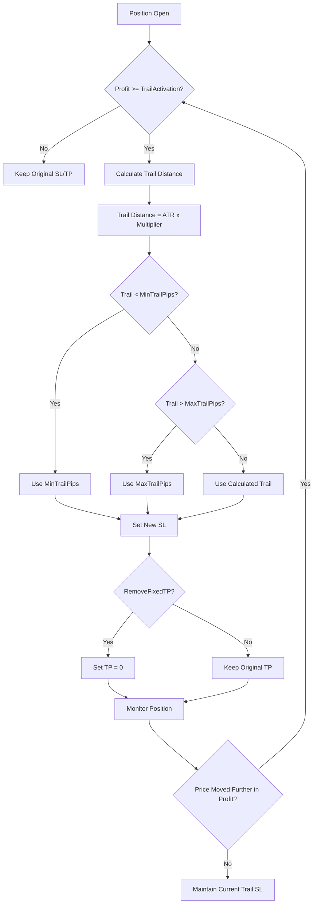

# TDI Bounce EA GBPUSD - Improvement Plan v3.0

**Date:** 2026-01-24  
**Author:** Engineering Team  
**Objective:** Increase trade count to ~40-50 trades/year while maintaining profitability, and implement ATR-based trailing stop to let winners run longer.

---

## Executive Summary

The current GBPUSD-optimized EA achieved profitability by adding aggressive filters, but reduced trade count from 46 to just 11 trades per year. This plan outlines improvements to achieve the target of ~40-50 trades/year while:

1. Maintaining a positive profit factor (>1.2)
2. Implementing ATR-based trailing stop to capture larger winners
3. Keeping drawdown under control (<5%)

---

## Current State Analysis

### Performance Comparison

| Metric | Original | Current v2 | Target v3 |
|--------|----------|------------|-----------|
| Total Trades | 46 | 11 | 40-50 |
| Net Profit | -$4,588 | +$868 | >$2,500 |
| Profit Factor | 0.76 | 1.27 | >1.3 |
| Win Rate | 58.7% | 63.6% | ~65% |
| Max Drawdown | 9.76% | 2.97% | <5% |
| Avg Winner | $532 | $584 | >$700 |

### Current Filter Settings Causing Low Trade Count

| Filter | Current Setting | Impact | Trades Blocked |
|--------|-----------------|--------|----------------|
| TDI Zone Filter | Yellow 45-55 range | High | ~15-20 |
| MinDistanceFromEMA | 10 pips | Medium | ~8-10 |
| ATR Max Multiplier | 1.5x average | Medium | ~5-8 |
| Green-Red Min Gap | 2.0 points | Low | ~3-5 |

---

## Proposed Changes

### Phase 1: Relax Filters to Increase Trade Count

#### 1.1 TDI Zone Filter - RELAX

```
Current:  TDI_ZoneLower = 45.0, TDI_ZoneUpper = 55.0
Proposed: TDI_ZoneLower = 40.0, TDI_ZoneUpper = 60.0
```

**Rationale:** A 45-55 range is too restrictive. Widening to 40-60 allows entry during early trend stages while still filtering extreme overbought/oversold conditions.

**Expected Impact:** +10-12 trades/year

#### 1.2 MinDistanceFromEMA - REDUCE

```
Current:  MinDistanceFromEMA = 10 pips
Proposed: MinDistanceFromEMA = 6 pips
```

**Rationale:** 10 pips is too conservative for GBPUSD. Many good bounces occur within 6-10 pips of the 200 EMA. Keep it above 5 to filter noise but allow more entries.

**Expected Impact:** +6-8 trades/year

#### 1.3 ATR Filter - LOOSEN

```
Current:  ATR_MaxMultiplier = 1.5
Proposed: ATR_MaxMultiplier = 2.0
```

**Rationale:** GBPUSD is inherently more volatile than EURUSD. A 1.5x multiplier filters too many valid setups. 2.0x allows trading during normal to moderately elevated volatility while still avoiding extreme conditions.

**Expected Impact:** +5-7 trades/year

#### 1.4 Green-Red Gap - REDUCE

```
Current:  TDI_GreenRedMinGap = 2.0
Proposed: TDI_GreenRedMinGap = 1.0
```

**Rationale:** A 2.0 gap requirement filters many valid crossover signals. Reducing to 1.0 allows entry on cleaner but earlier signals.

**Expected Impact:** +4-5 trades/year

---

### Phase 2: ATR-Based Trailing Stop Implementation

#### 2.1 New Input Parameters

```mql5
input group "=== Trailing Stop Settings ==="
input bool     UseTrailingStop         = true;         // Enable ATR Trailing Stop
input double   TrailActivationPips     = 15.0;         // Profit pips before trail starts
input double   TrailATRMultiplier      = 1.5;          // Trail distance = ATR x multiplier
input double   MinTrailStopPips        = 10.0;         // Minimum trail distance in pips
input double   MaxTrailStopPips        = 30.0;         // Maximum trail distance in pips
input bool     RemoveFixedTP           = true;         // Remove fixed TP when trailing
```

#### 2.2 Trailing Stop Logic Flow



#### 2.3 Implementation Code Structure

```mql5
//+------------------------------------------------------------------+
//| ATR Trailing Stop Function                                        |
//+------------------------------------------------------------------+
void ApplyATRTrailingStop()
{
    if(!UseTrailingStop) return;
    
    double currentATR = GetCurrentATR();
    double trailDistance = currentATR * TrailATRMultiplier;
    
    // Apply min/max bounds
    double minTrailPoints = MinTrailStopPips * g_point;
    double maxTrailPoints = MaxTrailStopPips * g_point;
    
    if(trailDistance < minTrailPoints) trailDistance = minTrailPoints;
    if(trailDistance > maxTrailPoints) trailDistance = maxTrailPoints;
    
    for(int i = PositionsTotal() - 1; i >= 0; i--)
    {
        if(positionInfo.SelectByIndex(i))
        {
            if(positionInfo.Symbol() != _Symbol || 
               positionInfo.Magic() != MagicNumber) continue;
            
            double openPrice = positionInfo.PriceOpen();
            double currentSL = positionInfo.StopLoss();
            double currentTP = positionInfo.TakeProfit();
            double activationPoints = TrailActivationPips * g_point;
            
            symbolInfo.RefreshRates();
            
            if(positionInfo.PositionType() == POSITION_TYPE_BUY)
            {
                double currentPrice = symbolInfo.Bid();
                double profit = currentPrice - openPrice;
                
                // Check if we should activate trailing
                if(profit >= activationPoints)
                {
                    double newSL = NormalizeDouble(currentPrice - trailDistance, g_digits);
                    
                    // Only move SL if it would improve position
                    if(newSL > currentSL)
                    {
                        double newTP = RemoveFixedTP ? 0 : currentTP;
                        if(trade.PositionModify(positionInfo.Ticket(), newSL, newTP))
                        {
                            Print("BUY Trail: New SL = ", newSL, 
                                  " ATR Trail = ", DoubleToString(trailDistance/g_point, 1), " pips");
                        }
                    }
                }
            }
            else if(positionInfo.PositionType() == POSITION_TYPE_SELL)
            {
                double currentPrice = symbolInfo.Ask();
                double profit = openPrice - currentPrice;
                
                // Check if we should activate trailing
                if(profit >= activationPoints)
                {
                    double newSL = NormalizeDouble(currentPrice + trailDistance, g_digits);
                    
                    // Only move SL if it would improve position
                    if(newSL < currentSL || currentSL == 0)
                    {
                        double newTP = RemoveFixedTP ? 0 : currentTP;
                        if(trade.PositionModify(positionInfo.Ticket(), newSL, newTP))
                        {
                            Print("SELL Trail: New SL = ", newSL,
                                  " ATR Trail = ", DoubleToString(trailDistance/g_point, 1), " pips");
                        }
                    }
                }
            }
        }
    }
}
```

#### 2.4 Integration into OnTick

```mql5
void OnTick()
{
    symbolInfo.RefreshRates();
    
    // Manage existing positions
    ManagePositions();        // Existing breakeven logic
    ApplyATRTrailingStop();   // NEW: ATR trailing stop
    
    // ... rest of OnTick logic
}
```

---

### Phase 3: Additional Optimizations

#### 3.1 Remove Strict EMA 10 Crossover Requirement

**Current Logic:**
```mql5
close1 > ema10_1 &&           // Price closed above 10 EMA
close2 <= ema10_2 &&          // Previous close was at/below 10 EMA
```

**Proposed Logic:**
```mql5
close1 > ema10_1 &&           // Price closed above 10 EMA
(close2 <= ema10_2 || close2 <= close1 * 0.9995) // Allow near-misses
```

**Rationale:** The strict EMA 10 crossover requirement misses many valid setups where price was just slightly above the EMA on the previous bar. Adding a small tolerance allows more entries.

#### 3.2 Add Optional Time-Based Exit

If a trade has been open for X hours and is in profit but not moving, close it to free capital:

```mql5
input bool     UseTimeBasedExit        = false;        // Enable time-based exit
input int      MaxHoldingHours         = 24;           // Close after X hours if in profit
input double   MinProfitForTimeExit    = 5.0;          // Minimum pips profit for time exit
```

---

## Recommended Parameter Settings for Testing

### Test Configuration A: Balanced Approach

```
// Relaxed Filters
TDI_ZoneLower = 40.0
TDI_ZoneUpper = 60.0
MinDistanceFromEMA = 6
ATR_MaxMultiplier = 2.0
TDI_GreenRedMinGap = 1.0

// ATR Trailing Stop
UseTrailingStop = true
TrailActivationPips = 15.0
TrailATRMultiplier = 1.5
MinTrailStopPips = 10.0
MaxTrailStopPips = 30.0
RemoveFixedTP = true

// Keep existing
StopLossPips = 25.0
BreakevenPips = 16.0
```

### Test Configuration B: Aggressive Trade Count

```
// More Relaxed Filters
TDI_ZoneLower = 38.0
TDI_ZoneUpper = 62.0
MinDistanceFromEMA = 5
ATR_MaxMultiplier = 2.5
TDI_GreenRedMinGap = 0.5

// ATR Trailing Stop
UseTrailingStop = true
TrailActivationPips = 12.0
TrailATRMultiplier = 1.2
MinTrailStopPips = 8.0
MaxTrailStopPips = 25.0
RemoveFixedTP = true
```

### Test Configuration C: Conservative with Trailing

```
// Slightly Relaxed Filters
TDI_ZoneLower = 42.0
TDI_ZoneUpper = 58.0
MinDistanceFromEMA = 7
ATR_MaxMultiplier = 1.8
TDI_GreenRedMinGap = 1.5

// ATR Trailing Stop
UseTrailingStop = true
TrailActivationPips = 18.0
TrailATRMultiplier = 2.0
MinTrailStopPips = 12.0
MaxTrailStopPips = 35.0
RemoveFixedTP = true
```

---

## Implementation Checklist

### Code Changes Required

- [ ] Add new input parameters for trailing stop settings
- [ ] Implement [`ApplyATRTrailingStop()`](TdiBounceEA/TDI_Bounce_EA_GBPUSD.mq5:607) function
- [ ] Integrate trailing stop into [`OnTick()`](TdiBounceEA/TDI_Bounce_EA_GBPUSD.mq5:201) 
- [ ] Update [`DisplayInfo()`](TdiBounceEA/TDI_Bounce_EA_GBPUSD.mq5:726) to show trailing stop status
- [ ] Modify default filter parameters per recommendations

### Backtesting Plan

1. **Test 1:** Configuration A (Balanced) - Full year backtest
2. **Test 2:** Configuration B (Aggressive) - Full year backtest  
3. **Test 3:** Configuration C (Conservative) - Full year backtest
4. **Test 4:** Best performing config with Monte Carlo analysis
5. **Test 5:** Walk-forward optimization on 3-month windows

### Success Criteria

| Metric | Minimum | Target |
|--------|---------|--------|
| Total Trades/Year | 35 | 40-50 |
| Profit Factor | 1.2 | 1.4+ |
| Win Rate | 60% | 65% |
| Max Drawdown | <6% | <4% |
| Average Winner | >$600 | >$800 |
| Sharpe Ratio | >0.5 | >1.0 |

---

## Risk Considerations

### Potential Downsides of Relaxing Filters

1. **More losing trades:** Relaxed filters will allow some trades that would have been filtered. This is expected and acceptable if overall profitability improves.

2. **Larger drawdowns:** More trades mean more potential for consecutive losses. The trailing stop should help offset this by capturing larger winners.

3. **Over-optimization risk:** Carefully test across different market conditions to ensure robustness.

### Mitigation Strategies

1. **Staged implementation:** Test each change individually before combining
2. **Out-of-sample testing:** Reserve 3 months of data for validation
3. **Position sizing:** Keep risk per trade at 1% maximum
4. **Maximum daily loss limit:** Consider adding daily loss limit logic

---

## Summary

This improvement plan addresses both user requirements:

1. **Increase trade count (11 → 40-50):** By relaxing the TDI Zone Filter, MinDistanceFromEMA, ATR Filter, and Green-Red Gap requirements

2. **Let winners run longer:** By implementing ATR-based trailing stop that adapts to market volatility

The key insight is that the current version over-filtered trades to achieve profitability. A better approach is moderate filtering combined with better trade management (trailing stops) to maximize profit from winning trades.

---

## Next Steps for Engineers

1. Review this plan and confirm understanding
2. Implement changes in [`TDI_Bounce_EA_GBPUSD.mq5`](TdiBounceEA/TDI_Bounce_EA_GBPUSD.mq5)
3. Run backtests with Test Configuration A first
4. Document results and iterate if needed
5. If successful, apply similar logic to EURUSD version

---

*Document Version: 3.0*  
*Last Updated: 2026-01-24*
