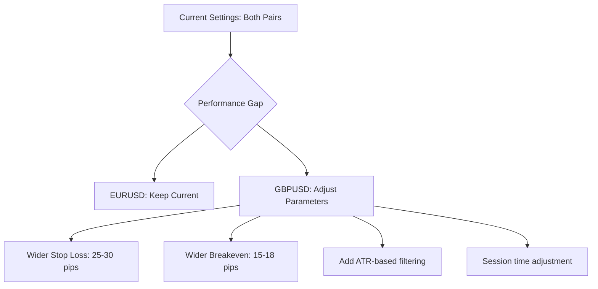
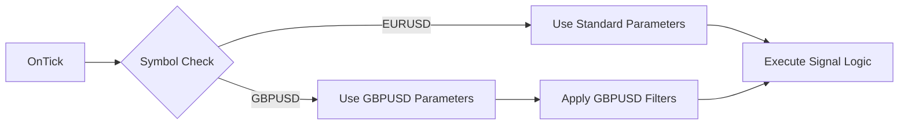

# TDI Bounce EA: EURUSD vs GBPUSD Performance Analysis

## Executive Summary

The TDI Bounce EA shows **significantly different performance** between EURUSD and GBPUSD over the same test period (2025.01.01 - 2026.01.23):

| Metric | EURUSD | GBPUSD | Difference |
|--------|--------|--------|------------|
| **Total Net Profit** | +$16,802.66 | -$4,588.20 | $21,390.86 |
| **Profit Factor** | 2.56 | 0.76 | 1.80 |
| **Win Rate** | 80.39% | 58.70% | 21.69% |
| **Max Drawdown** | 3.77% | 9.76% | -5.99% |
| **Recovery Factor** | 4.04 | -0.45 | 4.49 |
| **Total Trades** | 51 | 46 | +5 |

---

## Detailed Metrics Comparison

### 1. Profitability Analysis

| Metric | EURUSD | GBPUSD |
|--------|--------|--------|
| Gross Profit | $27,571.89 | $14,376.86 |
| Gross Loss | -$10,769.23 | -$18,965.06 |
| Expected Payoff | +$329.46 | -$99.74 |
| Sharpe Ratio | 14.96 | -5.00 |

### 2. Trade Statistics

| Metric | EURUSD | GBPUSD |
|--------|--------|--------|
| Total Trades | 51 | 46 |
| Profit Trades | 41 (80.39%) | 27 (58.70%) |
| Loss Trades | 10 (19.61%) | 19 (41.30%) |
| Largest Profit | $2,909.75 | $1,025.15 |
| Largest Loss | -$1,171.83 | -$1,035.15 |
| Avg Profit Trade | $672.49 | $532.48 |
| Avg Loss Trade | -$1,076.92 | -$998.16 |

### 3. Consecutive Trade Analysis

| Metric | EURUSD | GBPUSD |
|--------|--------|--------|
| Max Consecutive Wins | 17 | 6 |
| Max Consecutive Losses | 2 | 4 |
| Avg Consecutive Wins | 6 | 2 |
| Avg Consecutive Losses | 1 | 2 |

### 4. Trade Direction Breakdown

| Direction | EURUSD Win% | GBPUSD Win% |
|-----------|-------------|-------------|
| **Long Trades** | 76.92% (26 trades) | 68.18% (22 trades) |
| **Short Trades** | 84.00% (25 trades) | 50.00% (24 trades) |

### 5. Position Holding Time

| Metric | EURUSD | GBPUSD |
|--------|--------|--------|
| Minimum | 0:03:40 | 0:01:30 |
| Maximum | 19:16:05 | 9:25:36 |
| Average | 2:51:43 | 1:29:53 |

---

## Root Cause Analysis

### Key Finding 1: Short Trade Performance Disparity

The most striking difference is in **short trade performance**:
- EURUSD Short Win Rate: **84.00%**
- GBPUSD Short Win Rate: **50.00%**

This 34% gap in short trade accuracy is the primary driver of the performance difference.

### Key Finding 2: Consecutive Loss Patterns

GBPUSD shows more **clustering of losses**:
- GBPUSD has up to 4 consecutive losses vs EURUSD's maximum of 2
- Maximum consecutive loss amount: GBPUSD -$4,031.11 vs EURUSD -$2,217.94

### Key Finding 3: Market Characteristic Differences

#### EURUSD Characteristics:
- More orderly trends during London/NY sessions
- TDI bounces tend to follow through more reliably
- 200 EMA acts as stronger support/resistance

#### GBPUSD Characteristics:
- Higher volatility - larger pip movements
- More false breakouts and whipsaws
- Economic news sensitivity (Bank of England, UK data)
- Tends to have sharper reversals after bounces

### Key Finding 4: Holding Time Analysis

GBPUSD averages only **1:29:53** holding time vs EURUSD's **2:51:43**:
- GBPUSD trades are getting stopped out faster
- Many GBPUSD trades fail within the first hour
- Indicates potential issue with stop loss placement for GBPUSD's volatility

---

## Detailed Trade-by-Trade Analysis

### GBPUSD Problematic Periods

1. **November 2025 - Significant Drawdown Period**
   - Nov 3: -$972, +$33.67, +$48.10, +$38.48
   - Nov 14: -$986.05
   - Nov 18: -$977.85, -$948.72
   - Multiple rapid reversals during high volatility periods

2. **May-July 2025 - Choppy Market**
   - May 22: -$1,035.15
   - May 30: -$1,025.10
   - Several breakeven exits
   - Market was ranging with false signals

3. **October/November 2025**
   - 4 consecutive losses around Oct 24 - Nov 3
   - Account drawdown peaked at 9.76%

---

## Improvement Recommendations

### Strategy A: GBPUSD-Specific Parameter Optimization



| Parameter | Current | GBPUSD Suggested | Rationale |
|-----------|---------|------------------|-----------|
| StopLossPips | 20 | 25-30 | GBPUSD higher volatility |
| BreakevenPips | 12 | 15-18 | Allow more room for swings |
| MinDistanceFromEMA | 5 | 7-10 | Wait for stronger bounces |

### Strategy B: Add Volatility Filter (ATR-Based)

```
Implementation concept:
- Calculate ATR(14) at signal time
- Skip trades when ATR > threshold for GBPUSD
- This filters out high-volatility periods with false signals
```

### Strategy C: Enhanced TDI Confirmation for GBPUSD

Current conditions may be too lenient for GBPUSD. Consider adding:

1. **TDI Zone Filter**: Only trade when yellow line is between 45-55 (neutral zone)
2. **Green-Red Gap Requirement**: Require minimum 2-point gap between Green and Red lines
3. **Yellow Line Slope Strength**: Require stronger slope (compare yellow[1] vs yellow[3])

### Strategy D: Session Time Refinement for GBPUSD

Current trading hours: 8:00-17:00 GMT

GBPUSD-specific optimization:
- **Recommended**: 8:00-11:00 GMT (London open, before overlap volatility)
- **Alternative**: 14:00-16:00 GMT (NY session, after initial volatility)

Avoid UK economic news releases (typically 7:00-10:00 GMT).

### Strategy E: Symbol-Specific Implementation



Add symbol-specific parameter sets in the EA:

```
// Example structure
input group "=== GBPUSD Specific Settings ==="
input double   GBPUSD_StopLossPips      = 25.0;
input double   GBPUSD_BreakevenPips     = 15.0;
input int      GBPUSD_MinDistanceFromEMA = 8;
input bool     GBPUSD_UseATRFilter      = true;
input double   GBPUSD_MaxATRMultiplier  = 1.5;
```

---

## Implementation Priority

### Phase 1: Quick Wins (Low Effort)
1. [ ] Adjust GBPUSD-specific Stop Loss to 25-30 pips
2. [ ] Adjust GBPUSD-specific Breakeven to 15-18 pips  
3. [ ] Increase MinDistanceFromEMA for GBPUSD to 8-10 pips

### Phase 2: Medium Effort Improvements
4. [ ] Add ATR filter to avoid high volatility periods
5. [ ] Implement symbol-specific parameter handling in EA
6. [ ] Add TDI zone filter (yellow line 45-55 range)

### Phase 3: Advanced Improvements
7. [ ] Separate session times for GBPUSD
8. [ ] Add news filter integration
9. [ ] Implement dynamic SL based on ATR

---

## Recommended Backtest Plan

### Test Order:
1. **Test 1**: GBPUSD with SL=25, BE=15 only
2. **Test 2**: GBPUSD with SL=25, BE=15, MinDistance=8
3. **Test 3**: Add ATR filter to best performing config
4. **Test 4**: Session time optimization

### Expected Outcome After Optimization:
- Target GBPUSD win rate: 65-70%
- Target profit factor: > 1.2
- Target max drawdown: < 6%

---

## Alternative Consideration: Remove GBPUSD

If optimization efforts fail to achieve acceptable results:

**Pros of EURUSD-only trading:**
- Consistent 80%+ win rate
- Low drawdown (3.77%)
- High profit factor (2.56)
- Simpler operation

**Cons:**
- Fewer trading opportunities (51 vs combined ~97)
- Concentration risk on single pair

---

## Conclusion

The TDI Bounce strategy fundamentally works better on EURUSD because:
1. EURUSD has more orderly price action during the trading sessions
2. The fixed 20-pip stop loss is better suited to EURUSD's volatility profile
3. TDI signals produce higher quality bounces on EURUSD

**Recommended Action**: Implement symbol-specific parameters for GBPUSD or disable GBPUSD trading until the strategy can be properly optimized for that pair's characteristics.

---

*Analysis Date: 2026-01-24*
*Test Period: 2025-01-01 to 2026-01-23*
*Platform: MetaTrader 5 (Build 5430)*
