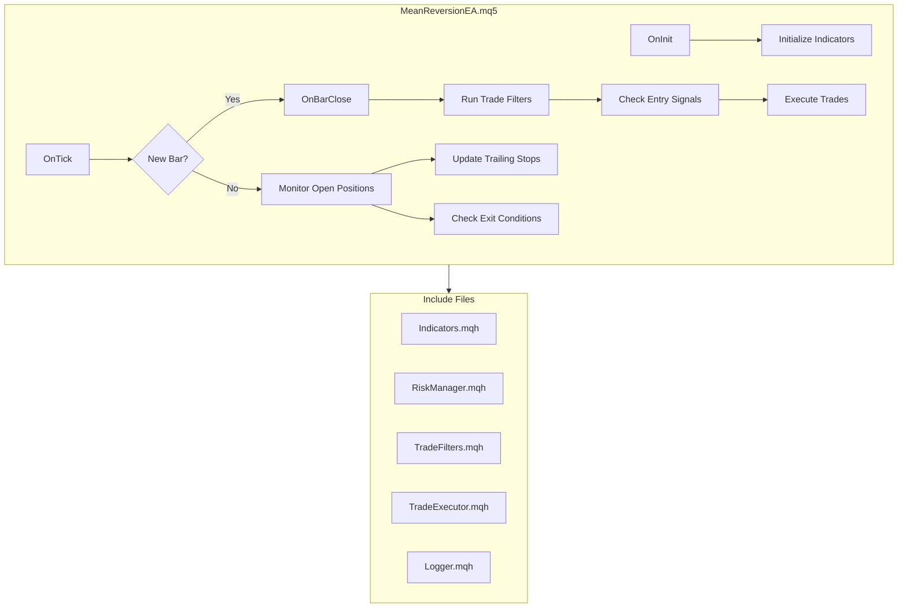

# EA Implementation Plan: Mean Reversion Strategy

## Project Overview
Build a MetaTrader 5 Expert Advisor (EA) implementing the Mean Reversion + Dynamic Regime Risk strategy as specified in `mean-reversion-strategy.md`.

---

## Architecture Overview



---

## File Structure

```
MT5-EA/
├── MQL5/
│   ├── Experts/
│   │   └── MeanReversionEA/
│   │       └── MeanReversionEA.mq5      # Main EA file
│   ├── Include/
│   │   └── MeanReversionEA/
│   │       ├── Indicators.mqh            # Indicator calculations
│   │       ├── RiskManager.mqh           # Position sizing & risk
│   │       ├── TradeFilters.mqh          # All trade filters
│   │       ├── TradeExecutor.mqh         # Order execution
│   │       ├── TrailingStop.mqh          # Chandelier exit logic
│   │       └── Logger.mqh                # Logging utilities
│   └── Scripts/
│       └── MeanReversionEA/
│           └── TestIndicators.mq5        # Indicator testing script
├── mean-reversion-strategy.md            # Strategy specification
├── implementation-plan.md                # This file
└── README.md                             # Project documentation
```

---

## Implementation Phases

### Phase 1: Project Setup & Core Infrastructure
**Estimated Time: 2-3 hours**

| Task | Description | File |
|------|-------------|------|
| 1.1 | Create folder structure | All directories |
| 1.2 | Create main EA skeleton with input parameters | MeanReversionEA.mq5 |
| 1.3 | Implement Logger module | Logger.mqh |
| 1.4 | Define common enums and structures | MeanReversionEA.mq5 |

**Input Parameters to Define:**
```cpp
// Indicator Settings
input int      InpADXPeriod = 14;
input int      InpATRPeriod = 14;
input int      InpBBPeriod = 20;
input double   InpBBDeviation = 2.0;
input int      InpRSIPeriod = 14;
input int      InpRSIOversold = 30;
input int      InpRSIOverbought = 70;
input int      InpADXThreshold = 25;

// Risk Management
input double   InpRiskPercent = 1.0;
input double   InpDailyLossLimit = 3.0;
input double   InpATRMultiplierTrend = 2.5;
input double   InpATRMultiplierRange = 1.5;

// Trade Filters
input double   InpSpreadMultiplier = 2.0;
input double   InpMinATR_ES = 5.0;
input double   InpMinATR_NQ = 20.0;
input int      InpCooldownBars = 3;
input int      InpNewsBufferMinutes = 5;
input int      InpMaxSlippageTicks = 3;

// Trading Hours (ET)
input int      InpTradingStartHour = 9;
input int      InpTradingStartMinute = 30;
input int      InpTradingEndHour = 16;
input int      InpTradingEndMinute = 0;

// General
input ulong    InpMagicNumber = 123456;
input string   InpTradeComment = "MeanRevEA";
```

---

### Phase 2: Indicator Module
**Estimated Time: 2-3 hours**

| Task | Description | File |
|------|-------------|------|
| 2.1 | Create indicator handle management | Indicators.mqh |
| 2.2 | Implement ADX calculation wrapper | Indicators.mqh |
| 2.3 | Implement ATR calculation wrapper | Indicators.mqh |
| 2.4 | Implement Bollinger Bands wrapper | Indicators.mqh |
| 2.5 | Implement RSI calculation wrapper | Indicators.mqh |
| 2.6 | Create indicator testing script | TestIndicators.mq5 |

**Key Functions:**
```cpp
class CIndicators
{
public:
    bool Initialize(string symbol, ENUM_TIMEFRAMES tf);
    void Deinitialize();
    
    double GetADX(int shift = 0);
    double GetATR(int shift = 0);
    double GetBBUpper(int shift = 0);
    double GetBBMiddle(int shift = 0);
    double GetBBLower(int shift = 0);
    double GetRSI(int shift = 0);
    
    bool IsDataReady();
};
```

---

### Phase 3: Trade Filters Module
**Estimated Time: 3-4 hours**

| Task | Description | File |
|------|-------------|------|
| 3.1 | Implement trading hours filter | TradeFilters.mqh |
| 3.2 | Implement spread filter with rolling average | TradeFilters.mqh |
| 3.3 | Implement minimum ATR filter | TradeFilters.mqh |
| 3.4 | Implement daily loss limit tracker | TradeFilters.mqh |
| 3.5 | Implement cooldown period tracker | TradeFilters.mqh |
| 3.6 | Implement news filter (basic time-based) | TradeFilters.mqh |

**Key Functions:**
```cpp
class CTradeFilters
{
public:
    bool Initialize();
    void OnNewBar();
    void OnTradeClose(double profit);
    
    bool IsWithinTradingHours();
    bool IsSpreadAcceptable();
    bool IsVolatilityAcceptable();
    bool IsDailyLossLimitOK();
    bool IsCooldownComplete(ENUM_ORDER_TYPE direction);
    bool IsNewsWindowClear();
    
    bool CanTrade(ENUM_ORDER_TYPE direction);  // Master filter check
    
    void ResetDailyStats();  // Called at market open
};
```

**Note on News Filter:**
For the initial implementation, we'll use a simple time-based approach where the user can manually input known news times. A more advanced version could integrate with an economic calendar API via MQL5 WebRequest.

---

### Phase 4: Risk Manager Module
**Estimated Time: 2-3 hours**

| Task | Description | File |
|------|-------------|------|
| 4.1 | Implement position size calculator | RiskManager.mqh |
| 4.2 | Implement stop loss distance calculator | RiskManager.mqh |
| 4.3 | Implement regime-based multiplier selection | RiskManager.mqh |
| 4.4 | Add lot size validation (min/max/step) | RiskManager.mqh |

**Key Functions:**
```cpp
class CRiskManager
{
public:
    bool Initialize(string symbol);
    
    double CalculateStopDistance(double atr, bool isTrending);
    double CalculatePositionSize(double stopDistance);
    double GetTakeProfit(double bbMiddle, ENUM_ORDER_TYPE type);
    
    bool ValidateLotSize(double &lots);
    double GetTickValue();
};
```

**Position Size Formula:**
```cpp
double CalculatePositionSize(double stopDistance)
{
    double accountEquity = AccountInfoDouble(ACCOUNT_EQUITY);
    double riskAmount = accountEquity * (InpRiskPercent / 100.0);
    double tickValue = GetTickValue();
    double tickSize = SymbolInfoDouble(_Symbol, SYMBOL_TRADE_TICK_SIZE);
    
    double stopTicks = stopDistance / tickSize;
    double lots = riskAmount / (stopTicks * tickValue);
    
    ValidateLotSize(lots);
    return lots;
}
```

---

### Phase 5: Trade Executor Module
**Estimated Time: 2-3 hours**

| Task | Description | File |
|------|-------------|------|
| 5.1 | Implement market order execution | TradeExecutor.mqh |
| 5.2 | Implement slippage checking and logging | TradeExecutor.mqh |
| 5.3 | Implement position closing logic | TradeExecutor.mqh |
| 5.4 | Add error handling and retry logic | TradeExecutor.mqh |

**Key Functions:**
```cpp
class CTradeExecutor
{
public:
    bool Initialize(ulong magicNumber, string comment);
    
    bool OpenBuy(double lots, double sl, double tp);
    bool OpenSell(double lots, double sl, double tp);
    bool ClosePosition(ulong ticket);
    bool ModifyStopLoss(ulong ticket, double newSL);
    
    bool HasOpenPosition();
    ulong GetOpenTicket();
    ENUM_ORDER_TYPE GetPositionType();
    double GetPositionOpenPrice();
    
private:
    bool CheckSlippage(double requestedPrice, double executedPrice);
};
```

---

### Phase 6: Trailing Stop Module
**Estimated Time: 2-3 hours**

| Task | Description | File |
|------|-------------|------|
| 6.1 | Implement Chandelier Exit calculation | TrailingStop.mqh |
| 6.2 | Track highest high / lowest low since entry | TrailingStop.mqh |
| 6.3 | Implement stop update logic (never retreat) | TrailingStop.mqh |
| 6.4 | Handle regime changes during trade | TrailingStop.mqh |

**Key Functions:**
```cpp
class CTrailingStop
{
public:
    void OnPositionOpen(ENUM_ORDER_TYPE type, double entryPrice);
    void OnNewBar(double high, double low, double atr, bool isTrending);
    
    double GetCurrentStop();
    bool ShouldUpdateStop();
    
private:
    double m_highestHigh;
    double m_lowestLow;
    double m_currentStop;
    ENUM_ORDER_TYPE m_positionType;
};
```

---

### Phase 7: Main EA Integration
**Estimated Time: 3-4 hours**

| Task | Description | File |
|------|-------------|------|
| 7.1 | Implement OnInit - initialize all modules | MeanReversionEA.mq5 |
| 7.2 | Implement OnDeinit - cleanup | MeanReversionEA.mq5 |
| 7.3 | Implement OnTick - main loop | MeanReversionEA.mq5 |
| 7.4 | Implement new bar detection | MeanReversionEA.mq5 |
| 7.5 | Implement entry signal detection | MeanReversionEA.mq5 |
| 7.6 | Implement exit signal detection | MeanReversionEA.mq5 |
| 7.7 | Wire up all modules | MeanReversionEA.mq5 |

**Main Logic Flow:**
```cpp
void OnTick()
{
    // Check for new bar
    if(!IsNewBar()) 
    {
        // Only update trailing stop on existing position
        if(g_executor.HasOpenPosition())
            UpdateTrailingStop();
        return;
    }
    
    // New bar processing
    g_filters.OnNewBar();
    
    // Check for exit on open position
    if(g_executor.HasOpenPosition())
    {
        CheckExitConditions();
        UpdateTrailingStop();
        return;  // Don't look for new entries while in position
    }
    
    // Check if we can trade
    if(!g_filters.CanTrade(ORDER_TYPE_BUY) && !g_filters.CanTrade(ORDER_TYPE_SELL))
        return;
    
    // Check for entry signals
    CheckEntrySignals();
}
```

---

### Phase 8: Testing & Optimization
**Estimated Time: 4-6 hours**

| Task | Description |
|------|-------------|
| 8.1 | Compile and fix any errors |
| 8.2 | Visual testing in Strategy Tester |
| 8.3 | Verify indicator values match expected |
| 8.4 | Test each filter individually |
| 8.5 | Test entry/exit logic |
| 8.6 | Run backtest on ES (2 years data) |
| 8.7 | Run backtest on NQ (2 years data) |
| 8.8 | Analyze results and adjust parameters |
| 8.9 | Out-of-sample validation (6 months) |

---

## Implementation Checklist

### Phase 1: Project Setup
- [ ] Create folder structure
- [ ] Create MeanReversionEA.mq5 skeleton
- [ ] Define all input parameters
- [ ] Implement Logger.mqh

### Phase 2: Indicators
- [ ] Implement CIndicators class
- [ ] ADX wrapper
- [ ] ATR wrapper
- [ ] Bollinger Bands wrapper
- [ ] RSI wrapper
- [ ] Create TestIndicators.mq5

### Phase 3: Trade Filters
- [ ] Implement CTradeFilters class
- [ ] Trading hours filter
- [ ] Spread filter
- [ ] Min ATR filter
- [ ] Daily loss limit
- [ ] Cooldown period
- [ ] News filter (basic)

### Phase 4: Risk Manager
- [ ] Implement CRiskManager class
- [ ] Position size calculator
- [ ] Stop distance calculator
- [ ] Lot size validation

### Phase 5: Trade Executor
- [ ] Implement CTradeExecutor class
- [ ] Market order execution
- [ ] Slippage checking
- [ ] Position management

### Phase 6: Trailing Stop
- [ ] Implement CTrailingStop class
- [ ] Chandelier Exit logic
- [ ] High/Low tracking
- [ ] Stop update logic

### Phase 7: Main EA
- [ ] OnInit implementation
- [ ] OnDeinit implementation
- [ ] OnTick implementation
- [ ] New bar detection
- [ ] Entry signal logic
- [ ] Exit signal logic
- [ ] Module integration

### Phase 8: Testing
- [ ] Compilation successful
- [ ] Visual testing passed
- [ ] Indicator verification
- [ ] Filter testing
- [ ] Entry/Exit testing
- [ ] ES backtest complete
- [ ] NQ backtest complete
- [ ] Out-of-sample validation

---

## Estimated Total Time
**18-25 hours** of development time

---

## Dependencies & Requirements
- MetaTrader 5 platform
- MQL5 development environment
- Historical data for ES and NQ (minimum 2 years)
- Broker account with access to ES/NQ futures

---

## Risk Considerations
1. **Slippage in live trading** may differ from backtests
2. **News events** not captured by basic filter could cause losses
3. **Regime changes** mid-trade may affect stop loss effectiveness
4. **Broker-specific** tick values and contract specifications must be verified

---

## Next Steps
1. Approve this implementation plan
2. Switch to Code mode to begin development
3. Start with Phase 1: Project Setup & Core Infrastructure