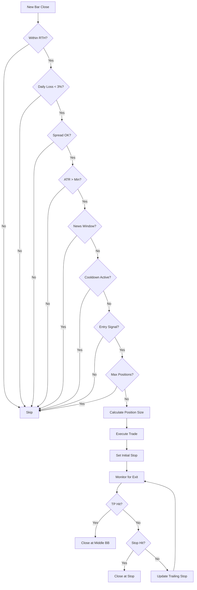

# Strategy Specification: ES/NQ Mean Reversion + Dynamic Regime Risk

## 1. Overview
A mean reversion strategy designed for stock index futures (ES/NQ) that adapts its risk management based on the market regime (Trending vs. Consolidating).

---

## 2. Trading Session
* **Instruments:** ES (E-mini S&P 500), NQ (E-mini Nasdaq 100)
* **Trading Hours:** US Regular Trading Hours (RTH) only
  * **Start:** 9:30 AM Eastern Time
  * **End:** 4:00 PM Eastern Time
* **Days:** Monday to Friday (excluding US market holidays)

---

## 3. Market Regime Filter (The "Switch")
The strategy identifies the market state using the **Average Directional Index (ADX)**.

* **Indicator:** ADX (14 Period)
* **Threshold:** 25
* **Logic:**
    * **Trending:** ADX >= 25
    * **Consolidating:** ADX < 25
* **Note:** The strategy trades in both regimes but adjusts stop loss distance accordingly.

---

## 4. Indicator Parameters

| Indicator | Parameter | Value |
|-----------|-----------|-------|
| ADX | Period | 14 |
| ATR | Period | 14 |
| Bollinger Bands | Period | 20 |
| Bollinger Bands | Std Dev Multiplier | 2.0 |
| RSI | Period | 14 |

---

## 5. Entry Logic
Classic Mean Reversion using Bollinger Bands (BB) and Relative Strength Index (RSI).

### Long Entry Conditions (ALL must be true)
1. **Price Action:** Price closes **below** the Lower Bollinger Band
2. **Momentum:** RSI (14) is **below** 30 (Oversold)
3. **Confirmation:** Entry bar closes bullish (Close > Open)
4. **Trigger:** Enter Market Buy on close of bar

### Short Entry Conditions (ALL must be true)
1. **Price Action:** Price closes **above** the Upper Bollinger Band
2. **Momentum:** RSI (14) is **above** 70 (Overbought)
3. **Confirmation:** Entry bar closes bearish (Close < Open)
4. **Trigger:** Enter Market Sell on close of bar

---

## 6. Exit Logic

### A. Take Profit (Primary Exit)
* **Target:** Middle Bollinger Band (20-period SMA)
* **Execution:** Close position when price touches or crosses the middle band

### B. Trailing Stop Loss (Chandelier Exit)
The stop loss multiplier changes based on the Regime identified above.

* **Trending Mode (ADX >= 25):** Stop Loss = 2.5 × ATR(14)
    * *Rationale:* Wider stops to accommodate trend volatility
* **Consolidating Mode (ADX < 25):** Stop Loss = 1.5 × ATR(14)
    * *Rationale:* Tighter stops to cut losses quickly if the range breaks

**Trailing Behavior:**
* Stop updates on **bar close** (not tick-by-tick)
* For Longs: Stop trails below the highest high since entry
* For Shorts: Stop trails above the lowest low since entry
* Stop **never retreats** - only moves in favor of the trade

---

## 7. Risk Management (The "Engine")

### A. Position Sizing
* **Risk per Trade:** Fixed 1.0% of Account Equity
* **Maximum Positions:** 1 (no pyramiding)
* **Calculation:**
  ```
  Position Size = (Account Equity × 0.01) / (Stop Distance × Tick Value)
  ```

### B. Daily Loss Limit
* **Threshold:** 3% of Account Equity
* **Action:** Stop all trading for the remainder of the day if daily losses exceed threshold
* **Reset:** Daily loss counter resets at market open (9:30 AM ET)

### C. Cooldown Period
* **Trigger:** After a losing trade
* **Duration:** Wait 3 bars before taking another signal in the same direction
* **Purpose:** Prevents revenge trading and allows market conditions to stabilize

---

## 8. Trade Filters (Skip Trade If)

### A. Spread Filter
* **Condition:** Current spread > 2× Average spread
* **Average Spread Calculation:** Rolling average of last 100 spread samples
* **Purpose:** Avoid trading during illiquid periods

### B. Minimum Volatility Filter
* **Condition:** ATR(14) < Minimum threshold
  * **ES:** Skip if ATR < 5 points
  * **NQ:** Skip if ATR < 20 points
* **Purpose:** Avoid low volatility periods where spreads eat into profits

### C. News Filter
* **Condition:** Within 5 minutes before or after major economic releases
* **Major Events:** NFP, FOMC, CPI, GDP, Retail Sales
* **Purpose:** Avoid unpredictable volatility spikes

### D. Slippage Tolerance
* **Maximum Acceptable Slippage:** 3 ticks
* **Action:** If execution slips more than 3 ticks, log the event for review
* **Purpose:** Monitor execution quality

---

## 9. Summary Flowchart



---

## 10. Implementation Notes

### MT5 Specific Considerations
1. **Timeframe:** Strategy should work on M15 or H1 charts (to be determined during backtesting)
2. **Magic Number:** Unique identifier for EA trades
3. **Logging:** All trade entries, exits, and filter triggers should be logged
4. **Alerts:** Optional alerts for trade signals and daily loss limit reached

### Backtesting Requirements
1. Test on minimum 2 years of historical data
2. Include commission and slippage in backtests
3. Validate on both ES and NQ separately
4. Out-of-sample testing on most recent 6 months

---

## 11. Version History

| Version | Date | Changes |
|---------|------|---------|
| 1.0 | 2024-12-16 | Initial specification |
| 1.1 | 2024-12-16 | Added: Take profit at middle BB, confirmation bar, daily loss limit, cooldown period, spread filter, min ATR filter, news filter, slippage tolerance. Clarified: ADX threshold (>=25), BB parameters, trading hours (RTH only), max positions (1), trailing stop update frequency (bar close) |