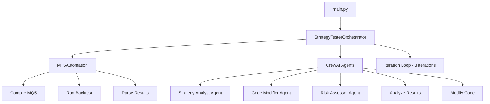
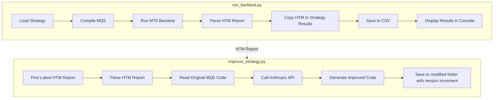

# MT5 Strategy Tester Simplification Plan

## Overview

This plan outlines the refactoring of the MT5 Strategy Tester to:
1. Remove CrewAI dependency and replace with direct Anthropic API calls
2. Split functionality into two separate scripts:
   - **run_backtest.py** - Runs backtests and saves results
   - **improve_strategy.py** - Reads results and generates improved EA code

## Current Architecture



## Proposed Architecture



## Files to Create

### 1. run_backtest.py
**Purpose**: Run a single strategy backtest and save results

**Features**:
- Accept strategy path as command-line argument
- Compile MQ5 file using MetaEditor
- Run backtest via MT5 Strategy Tester
- Parse HTM report results
- Copy HTM report to strategy's `results/` folder
- Save results to CSV file
- Display results in console

**Command-line Interface**:
```bash
python run_backtest.py --strategy ./strategies/LondonBreakoutEA/LondonBreakout_PropFirm_EA.mq5
python run_backtest.py --strategy ./strategies/LondonBreakoutEA/LondonBreakout_PropFirm_EA.mq5 --config ./config.yaml
```

### 2. improve_strategy.py
**Purpose**: Read backtest results and generate improved EA code

**Features**:
- Find most recent HTM report in strategy's results folder OR accept specific HTM path
- Parse HTM report to extract performance metrics
- Read original MQ5 source code
- Call Anthropic API with structured prompt focusing on:
  - Profitability improvement
  - Daily drawdown limit: 3%
  - Total drawdown limit: 10%
  - Target monthly profit: ~3%
- Generate improved MQ5 code
- Auto-increment version number for output file
- Save to `{strategy_folder}/modified/` directory

**Command-line Interface**:
```bash
# Use most recent HTM report
python improve_strategy.py --strategy ./strategies/LondonBreakoutEA/LondonBreakout_PropFirm_EA.mq5

# Use specific HTM report
python improve_strategy.py --strategy ./strategies/LondonBreakoutEA/LondonBreakout_PropFirm_EA.mq5 --report ./strategies/LondonBreakoutEA/results/report_20260130.htm
```

### 3. anthropic_client.py
**Purpose**: Direct Anthropic API integration module

**Features**:
- Simple wrapper around Anthropic Python SDK
- Structured prompt for strategy improvement
- Parse response to extract MQ5 code
- Error handling and retry logic

**Key Function**:
```python
def improve_strategy(
    strategy_code: str,
    backtest_results: BacktestResult,
    success_criteria: SuccessCriteria
) -> tuple[str, str]:
    """
    Returns: (improved_code, analysis_summary)
    """
```

## Files to Modify

### 1. config.yaml
**Changes**:
- Remove `crewai` section
- Add `anthropic` section with:
  - `model`: claude-sonnet-4-20250514
  - `temperature`: 0.3
  - `max_tokens`: 16000

### 2. config_loader.py
**Changes**:
- Remove `CrewAIConfig` dataclass
- Add `AnthropicConfig` dataclass
- Update `AppConfig` to use `AnthropicConfig`
- Update `load_config()` function

### 3. mt5_automation.py
**Changes**:
- Add method to copy HTM report to strategy results folder
- Update `run_backtest()` to return the HTM report path
- Ensure HTM parsing is robust

### 4. requirements.txt
**Changes**:
- Remove: `crewai`, `crewai-tools`, `langchain-anthropic`
- Keep: `anthropic`, `python-dotenv`, `pyyaml`, `MetaTrader5`

## Files to Remove

| File | Reason |
|------|--------|
| `main.py` | Replaced by `run_backtest.py` and `improve_strategy.py` |
| `crewai_agents.py` | Replaced by `anthropic_client.py` |

## Files to Keep (Unchanged)

| File | Purpose |
|------|---------|
| `models.py` | Data models - still needed |
| `logger.py` | Logging utilities - still needed |

## Anthropic API Prompt Structure

The improvement prompt will be structured as follows:

```
You are an expert MQL5 developer specializing in forex trading strategies.

## Current Strategy Performance
- Strategy: {strategy_name}
- Symbol: {symbol}, Timeframe: {timeframe}
- Period: {from_date} to {to_date}
- Net Profit: ${net_profit}
- Monthly Return: {monthly_return_pct}%
- Profit Factor: {profit_factor}
- Total Trades: {total_trades}
- Win Rate: {win_rate}%
- Max Drawdown: {max_drawdown_pct}%
- Max Daily Drawdown: {max_daily_drawdown_pct}%

## Target Criteria
- Monthly Profit Target: ~3%
- Maximum Daily Drawdown: 3%
- Maximum Total Drawdown: 10%
- Minimum Profit Factor: 1.5

## Current MQ5 Code
```mql5
{strategy_code}
```

## Instructions
Analyze the backtest results and improve the strategy to meet the target criteria.
Focus on:
1. Improving profitability while maintaining risk limits
2. Reducing drawdown if it exceeds limits
3. Optimizing entry/exit logic
4. Adjusting position sizing and risk management

Return the COMPLETE improved MQ5 code wrapped in ```mql5 code blocks.
Also provide a brief summary of changes made.
```

## Directory Structure After Refactoring

```
MT5StrategyTester/
├── run_backtest.py          # NEW - Backtest runner script
├── improve_strategy.py      # NEW - Strategy improvement script
├── anthropic_client.py      # NEW - Anthropic API wrapper
├── mt5_automation.py        # MODIFIED - Added HTM copy functionality
├── config_loader.py         # MODIFIED - Removed CrewAI, added Anthropic
├── config.yaml              # MODIFIED - Updated config sections
├── models.py                # UNCHANGED
├── logger.py                # UNCHANGED
├── requirements.txt         # MODIFIED - Simplified dependencies
├── README.md                # UPDATE - Document new usage
├── .env.example             # UNCHANGED
└── strategies/
    └── LondonBreakoutEA/
        ├── LondonBreakout_PropFirm_EA.mq5
        ├── results/
        │   ├── backtest_results.csv
        │   └── report_20260130.htm    # HTM reports copied here
        └── modified/
            ├── LondonBreakout_PropFirm_EA_v1.mq5
            └── LondonBreakout_PropFirm_EA_v2.mq5  # Auto-versioned
```

## Workflow Example

### Step 1: Run Backtest
```bash
cd MT5StrategyTester
python run_backtest.py --strategy ./strategies/LondonBreakoutEA/LondonBreakout_PropFirm_EA.mq5
```

**Output**:
```
📊 Running backtest for: LondonBreakout_PropFirm_EA
✅ Compilation successful
⏳ Running MT5 Strategy Tester...
✅ Backtest completed

📈 Results:
   Net Profit:     $-1,958.19
   Monthly Return: -1.96%
   Profit Factor:  0.34
   Total Trades:   10
   Win Rate:       30.0%
   Max Drawdown:   1.96%

📁 HTM Report saved to: ./strategies/LondonBreakoutEA/results/report_20260130_143022.htm
📁 CSV updated: ./strategies/LondonBreakoutEA/results/backtest_results.csv
```

### Step 2: Improve Strategy
```bash
python improve_strategy.py --strategy ./strategies/LondonBreakoutEA/LondonBreakout_PropFirm_EA.mq5
```

**Output**:
```
📊 Loading backtest results from: ./strategies/LondonBreakoutEA/results/report_20260130_143022.htm
🤖 Calling Anthropic API for strategy improvement...
✅ Improved strategy generated

📝 Changes Summary:
   - Adjusted stop loss from 50 to 35 pips
   - Added ATR-based position sizing
   - Modified entry filter to require stronger momentum

📁 Improved code saved to: ./strategies/LondonBreakoutEA/modified/LondonBreakout_PropFirm_EA_v2.mq5
```

### Step 3: Test Improved Version
```bash
python run_backtest.py --strategy ./strategies/LondonBreakoutEA/modified/LondonBreakout_PropFirm_EA_v2.mq5
```

## Implementation Order

1. **Update config files first** - Remove CrewAI, add Anthropic config
2. **Create anthropic_client.py** - Core API integration
3. **Create run_backtest.py** - Backtest-only script
4. **Create improve_strategy.py** - Improvement script
5. **Update mt5_automation.py** - Add HTM copy functionality
6. **Update requirements.txt** - Simplify dependencies
7. **Remove old files** - main.py, crewai_agents.py
8. **Update README.md** - Document new usage

## Benefits of This Approach

1. **Simpler Architecture**: Two focused scripts instead of one complex orchestrator
2. **Fewer Dependencies**: Remove CrewAI and langchain, use direct Anthropic SDK
3. **Better Control**: Run backtest and improvement separately
4. **Easier Debugging**: Each script has a single responsibility
5. **Flexible Workflow**: Can run multiple backtests before improving, or improve multiple times
6. **Lower Cost**: Direct API calls without CrewAI overhead
